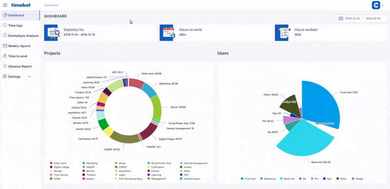
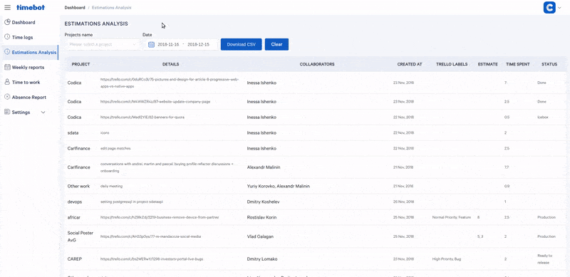
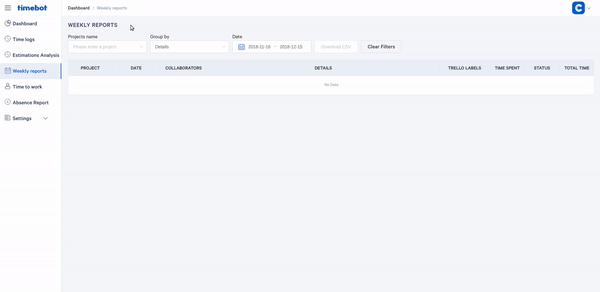
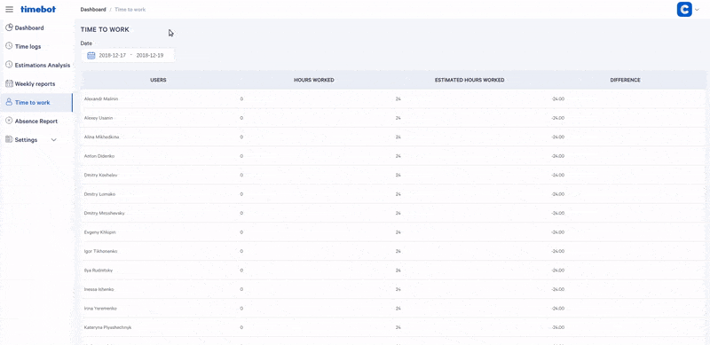
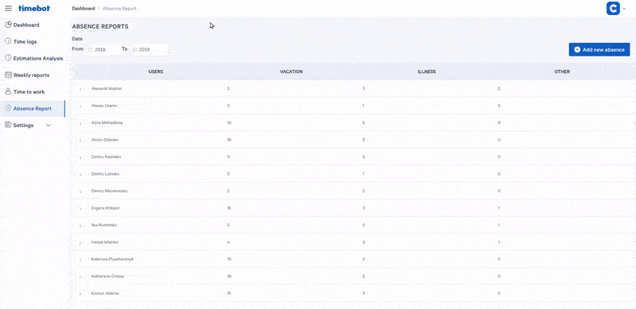

# Admin interface for timebot

The administration panel is the inner side of our time tracking tool. It is particularly valuable for project managers as it fully reflects the overall performance statistics on individuals, teams, and projects at any chosen time period.

The admin panel UI is very simple and attractive. We adopted ready-to-use vue.js libraries including customized elements.

## Dashboard

Since the Timebot suggests a diversity of options, all the records should be fully supervised.

The dashboard allows seeing overall statistics on the company, bound to time and each team member and process, such as PM, QA, FE, BE.

## Time logs

The present section serves as a flexible reporting system on different preferences. Here, project managers or customers can see common time spent on tasks or big complex challenges.

## Estimations Analysis

Roughly speaking, this is a comparison of plan and fact. We use it as an internal team metric which allows comparing the estimated time for a task and the valid time taken to complete it. The given feature shows a developer’s ability to the precise assessment of hours required to perform a task. In a long-term perspective, it’s a necessary tool for future project estimations.

## Weekly reports

The present part of the Administration panel generates recording and analysis of time spent to fulfil the task, helping account to our customers. It allows our project managers to track down taken for a particular task and the project as a whole.

## Time to work

This option provides a report on working for a scheduled time on each team member. Hence, project managers can assess the efficiency of everyone on the team, paying attention to their time management skills.

## Absence Report

This given feature allows browsing sick leaves and vacations of all the team members. It’s mostly useful for project managers and HR Department to keep a record of non-valid hours. It shows data of each team member with a number of days of absence.

## Settings

### Users

This option represents the distribution of team members by roles. It allows analyzing project development according to processes, such as design, back-end, front-end, testing, etc.

### Teams

The given board shows the current teams in the company. It also includes the TechStack and expertise available in each of them. The division in teams allows customizing the introduction of the information for teams management.

### Projects

The given page shows information on all the running projeсts. It provides all the relevant data, necessary for project managers, such as the date of project initiation and the current team working on it.

### Holidays

This option of the Admin panel provides an opportunity to add holidays to the Timebot. We have implemented this feature so that the Timebot could correctly display the number of estimated and valid hours.

### Admins

This section grants access for particular registered users to handle the information through the whole Administration panel. They can view, edit, remove and add the necessary data. It substantially simplifies the creation of reports for the accounting period.

## License
Timebot is Copyright © 2015-2018 Codica. It is released under the [MIT License](https://opensource.org/licenses/MIT).

## About Codica

Timebot is maintained and funded by Codica. The names and logos for Codica are trademarks of Codica.

We love open source software! See [our other projects](https://github.com/codica2) or [hire us](https://www.codica.com/) to design, develop, and grow your product.
